# REDUS Framework (Cloud) User Manual {#RF-cloud-guide}

Welcome to the user manual of the REDUS Framework. This guide will show you the step-by-step guide for running the assessment workflow using the REDUS Framework cloud application.

## Pre-requisites

1. An internet browser.
2. (Optional) Experience in the REDUS Survey Time Series XML Recipe [guide](#redus-master-recipe).

## Starting up

Point your browser to the URL of the REDUS framework:

```
http://myrto.hi.no:3000
```

> Note that the above URL can change

You'll be greeted with the assessment selection page as below:
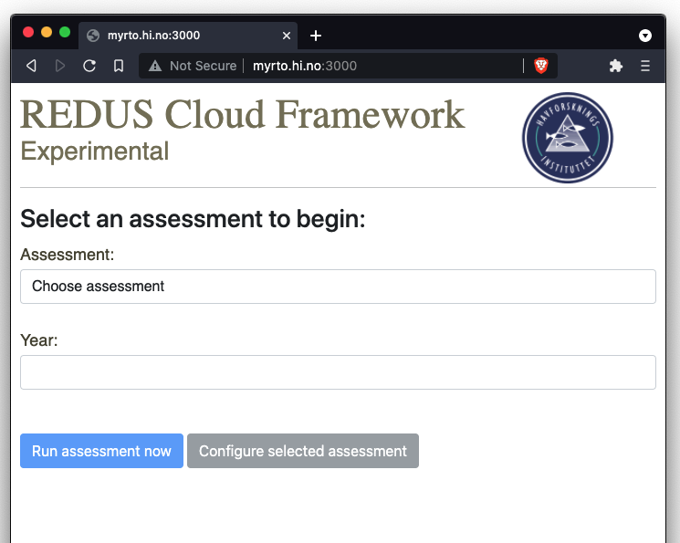

## Selecting an assessment

You may select the available assessment from the drop-down list.

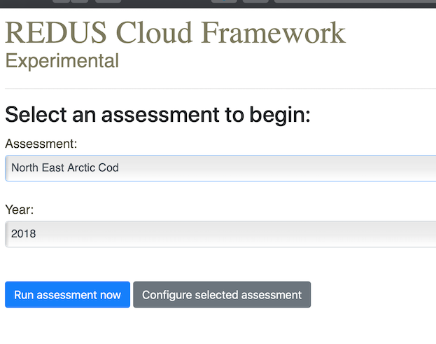

After selecting an assessment, click on `Run assessment now` button if you want to use the pre-defined configuration and data. Otherwise, click the `Configure selected assessment` button to configure the selected assessment prior to its run.

> **TIPS:** You can run multiple assessments in parallel if you wish to do that. Simply open a new browser tab and select another assessment to run.

## Configuring an assessment

As of now, the supported configuration of an assesment are:

1. Survey data
2. Assessment program selection

> **NOTE:** Support for *catch* and *acoustic* data is not yet supported.

### Configure the survey data

To configure the survey data input, click on the `Input data` on the left hand side menu and select `Survey data` on the tab menu. You will be presented by the list of survey data (by fleets) that is included in the assessment.

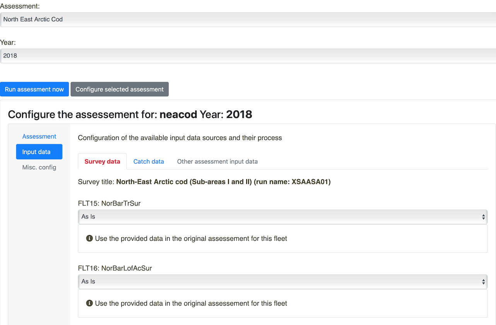

Each of these survey data can be individually modified using the drop down selection below the survey name. The supported actions are:

1. `As is` : This means that you don't want to modify the pre-defined data that comes with the assessment.

2. `(Official) Pre-computed values` : Choose this to use the *official* result from the nightly StoX survey time series run.
> **NOTE:** The official results are currently available here: <http://astarte.imr.no/ocpu/library/REDUStools/www/imrsts.html> . This was generated and served using the REDUStools R package available here: <https://github.com/REDUS-IMR/REDUStools>.

3. `Re-process using StoX` : This option will force the survey time series re-processing using StoX/Rstox. For this you will need to fill-in the recipe for the StoX processing. The recipe is an XML document. Below is a sample recipe for the `Barents Sea Northeast Arctic cod bottom trawl index in winter` survey time series:

```xml
<?xml version="1.0" encoding="UTF-8"?>
<redus_master xmlns="http://www.imr.no/formats/redus/master/v0.1" revision="1" version="0.1">
  <configuration>
    <saveOutputTable>true</saveOutputTable>
    <saveRunStatus>false</saveRunStatus>
  </configuration>
  <globalParameter>
    <!-- <fileFix from="biotic_cruiseNumber_1994001_Anny+Kræmer.xml" to="biotic_cruiseNumber_1994001_Anny+Kræmer.xml"/> -->
  </globalParameter>
  <parameters sts="Barents Sea Northeast Arctic cod bottom trawl index in winter" revision="1" version="0.1">
    <configuration>
      <stsName>Barents Sea Northeast Arctic cod bottom trawl index in winter</stsName>
      <overwriteNMD>false</overwriteNMD>
      <forceReProcess>true</forceReProcess>
      <forceBioticV3>true</forceBioticV3>
      <skipYear>1993</skipYear>
      <startYear></startYear>
      <endYear></endYear>
      <levelRequested>bootstrapImpute</levelRequested>
      <bootstrapSeed>77</bootstrapSeed>
      <bootstrapImputeSeed>101</bootstrapImputeSeed>
      <bootstrapIter>5</bootstrapIter>
      <coresUse>1</coresUse>
      <groupType>age</groupType>
      <minAge>1</minAge>
      <maxAge>12</maxAge>
      <plusAge>7</plusAge>
      <numberScale>1000000</numberScale>
      <dataType>survey</dataType>
      <applyOverrides>false</applyOverrides>
    </configuration>
    <override>
      <!-- <parameter name="UseProcessData">true</parameter> -->
    </override>
  </parameters>
</redus_master>
```
> **NOTE:** The documentation for the recipe is [here](#redus-master-recipe).

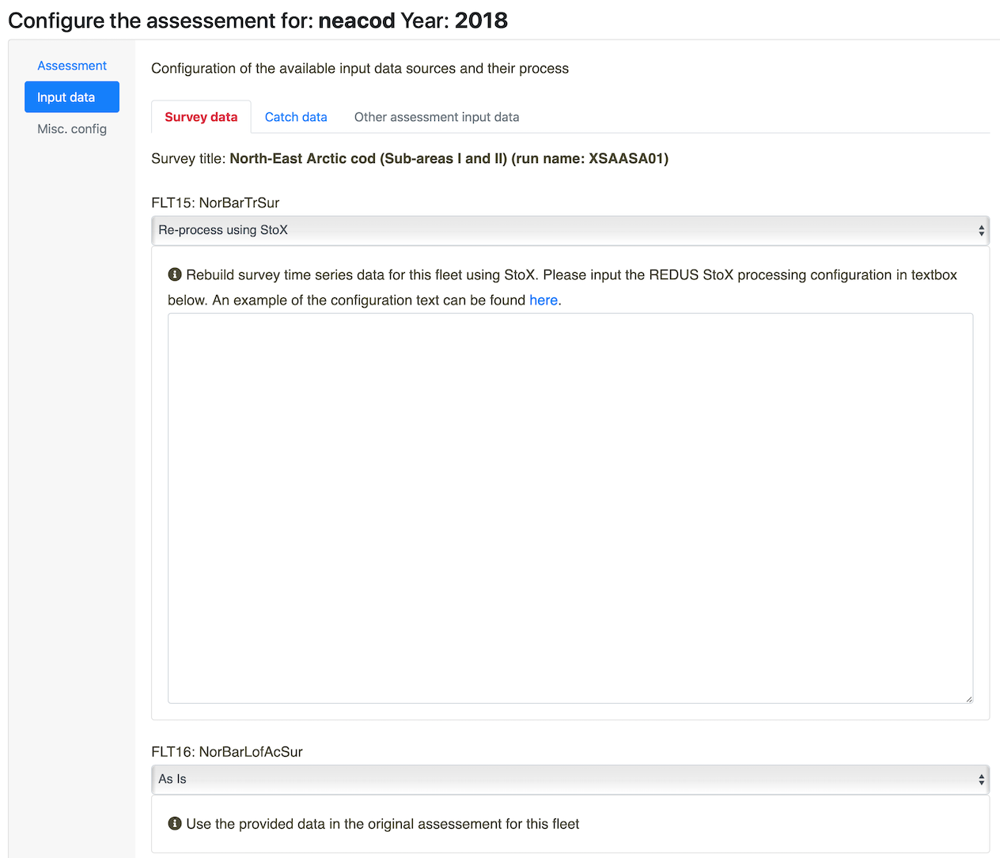

4. `Input manual values` : Here you can input manual values in the text format for the specified survey data.

### Configure the assessment program

To select the available assessment program, click on the `Assessment` from the left hand side menu. You'll be presented by the information of the current assessment used in the model and a drop down selection of `Latest SAM` and `Latest XSAM` option.

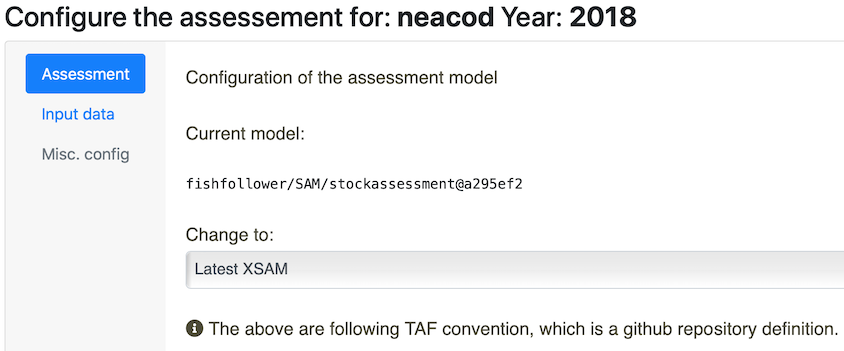

> **NOTE:** Latest SAM and XSAM is using the master branch of the <https://github.com/fishfollower/SAM> repository, the only difference is XSAM will try to use the covariance matrices from the StoX output

### Finish configuring

If you are finished with configuring, please click the `Run assessment now` button to run the assessment workflow using your defined configuration.

## Running the assessment

After clicking the `Run assessment now` button, there will be a popup that shows the status of the provisioning process before the assessment is run:

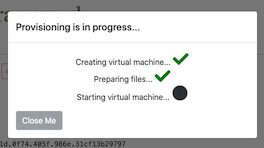

Sit back and wait until the provision is complete, in which indicated by the assessment run dashboard:

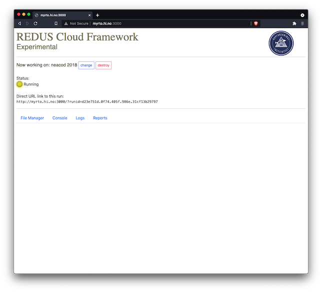

There are some important elements in the dashboard:

1. `change` button: This enables you to re-start a new assessment workflow.
2. `destroy` button: This will irreversibly destroy the current running assessment.
3. There is also a **direct URL link** to the run. With this link you can resume the current assessment from anywhere as long as you can connect to the REDUS framework server. For example you might run the assessment from your office computer and wanted to get the results later from your home computer (*e.g.*, via VPN).
4. Sets of tab menu items:

   a. `File Manager`: This tab provides an interface that is similar to *Windows Explorer* that can be used to explore files and to upload/download files from the current assessment workflow.
   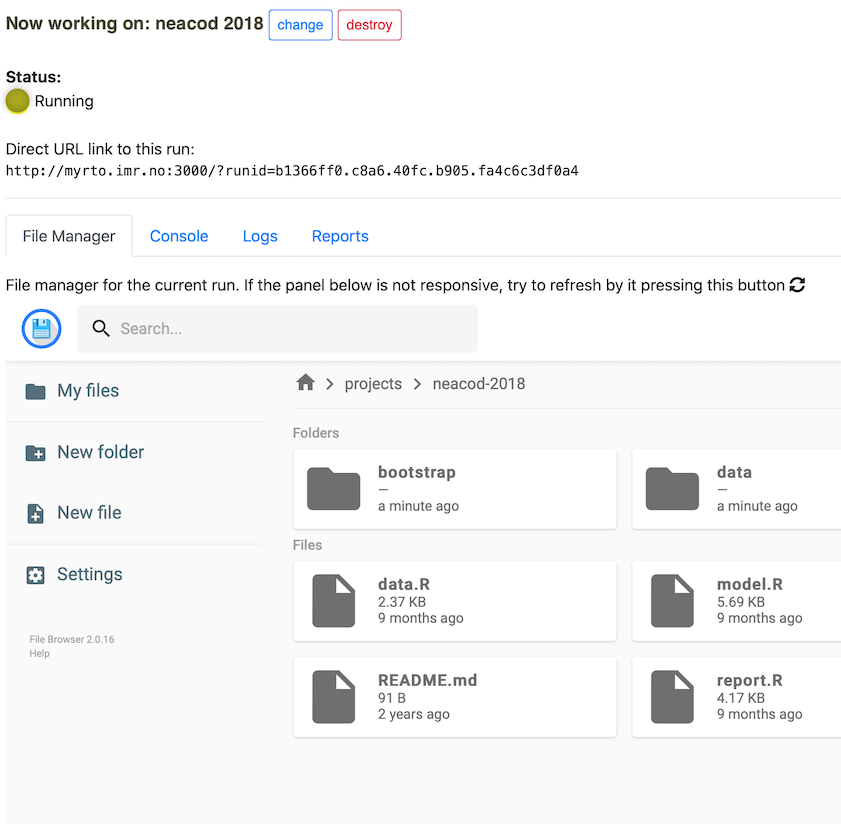

   b. `Console`: This tab provides a Linux console for the current assessment workflow. You can run `R` and experiment with stuffs.
   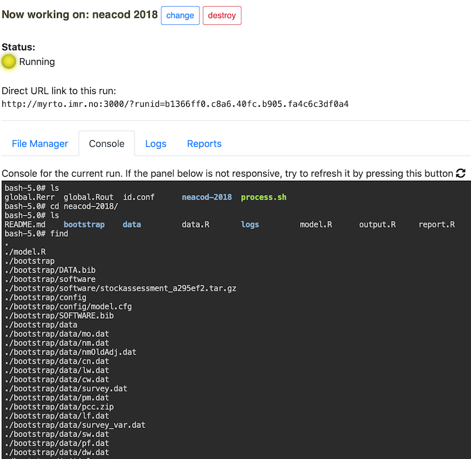

   c. `Logs`: This tab provides useful logs (outputs, warnings, errors) for the current assessment workflows. This is used mostly for debugging and finding errors.
   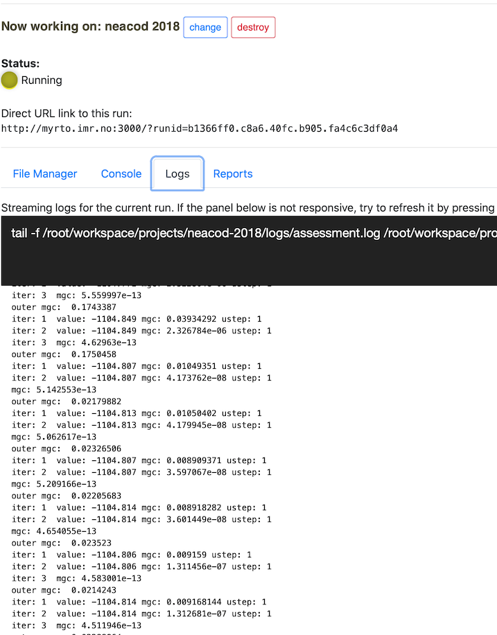

   d. `Reports`: After the assessment finishes, this tab will be active and provides the report and a link to the downloadable artifacts from the assessment workflow run.
   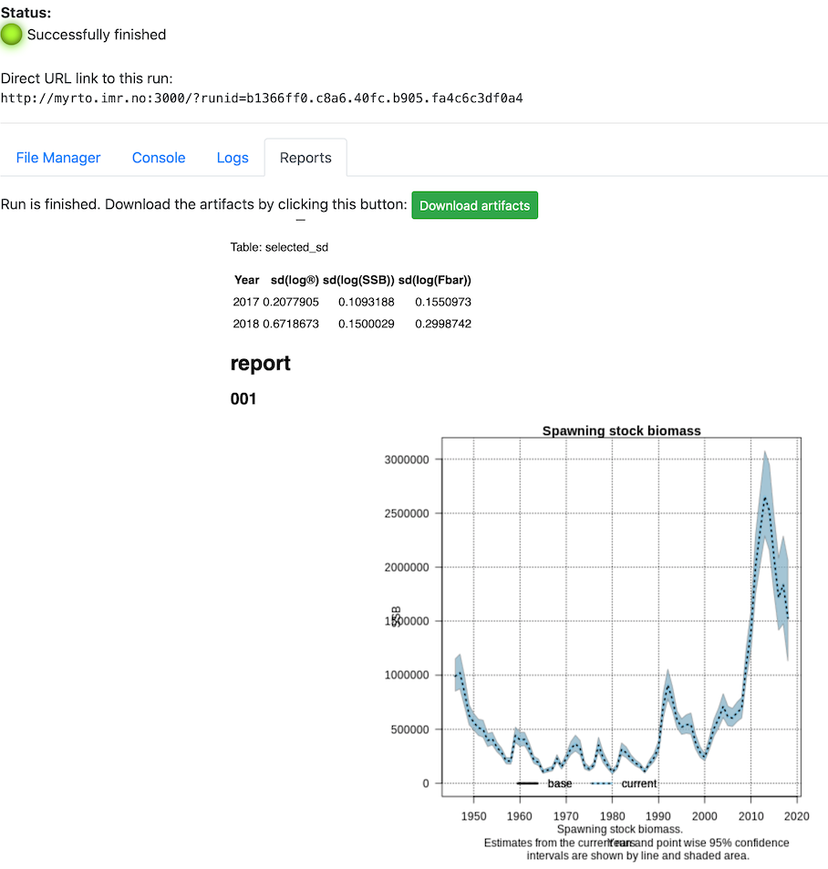
